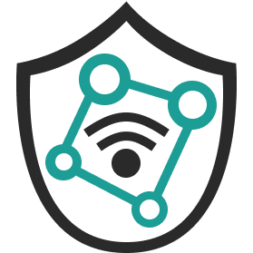

<!---
SPDX-License-Identifier: AGPL-3.0-or-later

Copyright (c) 2023 Nelson Vieira

@author Nelson Vieira <2080511@student.uma.pt>
@license AGPL-3.0 <https://www.gnu.org/licenses/agpl-3.0.txt>
--->

    

 

# IoT Privacy

This application displays information about IoT devices like the type of information these devices collect and what privacy options are available.
Users can add and edit IoT devices.

---

## Download

This application is still in beta.  
***Android only**, iOS coming soon*

[v0.32.0](https://github.com/nelson-vieira/masters-thesis/releases/tag/app%400.32.0)

## License

This application is licensed under a [AGPL-3.0 license](../../LICENSE-APP), except in `docs` directory which is licensed under the [CC-BY-4.0 license](../../LICENSE).
